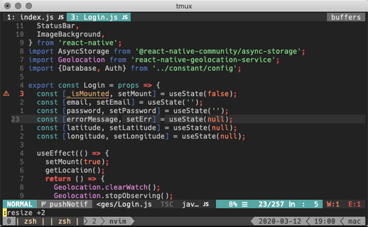

# No arrow keys in vim
 
vim-arrowless is vim plugin to disable arrows movement in vim,make your finger more focus on the keyboard

# Installation

> git clone https://github.com/difaagh/vim-arrowless.git ~/.vim/bundle/vim-arrowless

or you can install with plugin manager


Install with 

```vim
Plugin 'difaagh/vim-arrowless'
``` 

# Notes

be sure you dont mapping arrow keys before (`<Up>,<Down>,<Right>,<Left>`)
you can check it with verbose command

```vim
:verbose map <Up>
```
also check for the other arrow keys

# Screenshot


